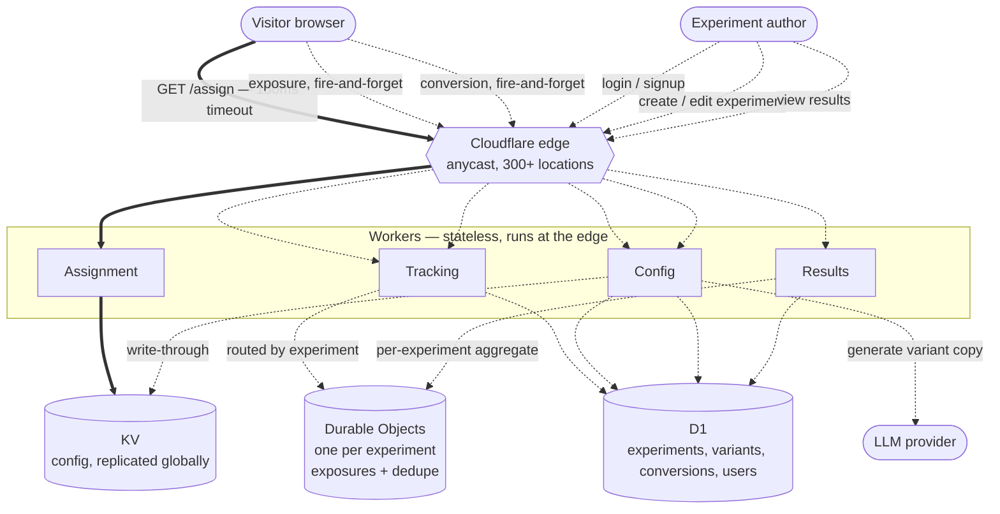

# A/B Testing Service — System Design

## 1. Overview

### 1.1 Purpose

The service assigns website visitors to experiment variants, records exposure and conversion events, and reports variant performance per experiment. Customer websites integrate through a small JavaScript snippet that executes on every page load.

### 1.2 Defining constraint

The assignment call occurs **while the customer's page is rendering**. It must complete quickly and must never prevent the page from rendering. This constraint determines the majority of the decisions in this document.

### 1.3 Non-goals for v1

Cross-device identity resolution, funnel and revenue goals, bot filtering, an administrative UI, and consent tooling are explicitly out of scope. Deferred items and their trigger conditions are listed in section 10.

---

## 2. Requirements

### 2.1 Functional requirements

| ID   | Requirement                                                                                                                                                                                                                                                                                                                        |
| ---- | ---------------------------------------------------------------------------------------------------------------------------------------------------------------------------------------------------------------------------------------------------------------------------------------------------------------------------------- |
| FR-1 | **Assignment.** Given a visitor and the set of active experiments, return the variant to render. A given visitor must always receive the same variant. Configured traffic splits (50/50, 90/10, holdback) must hold across the population. Multiple concurrent experiments and multiple variants per experiment must be supported. |
| FR-2 | **Tracking.** Persist exposure and conversion events durably. Duplicate event delivery must not corrupt counts.                                                                                                                                                                                                                    |
| FR-3 | **Results.** Per experiment, report exposures, conversions, and conversion rate for each variant.                                                                                                                                                                                                                                  |
| FR-4 | **Configuration.** Provide an API to define experiments, variants, and traffic allocation.                                                                                                                                                                                                                                         |
| FR-5 | **AI-assisted variant copy.** Variant content (headlines, CTAs) may be generated by an LLM. Provider API keys remain on the backend.                                                                                                                                                                                               |
| FR-6 | **Admin authentication.** Creating, pausing, and viewing results for an experiment requires a logged-in user. Only the owner of a site may manage or view that site's experiments.                                                                                                                                                |

### 2.2 Constraints

| ID  | Constraint                                                                                                           |
| --- | -------------------------------------------------------------------------------------------------------------------- |
| C-1 | Assignment executes on the page-render path. Latency and failure isolation are hard requirements, not optimisations. |
| C-2 | The service is multi-tenant: many independent websites share one deployment.                                         |

### 2.3 Service level objectives

| Workload                  | Objective                                                                                                     |
| ------------------------- | ------------------------------------------------------------------------------------------------------------- |
| Assignment                | Under 10 ms at the edge. The snippet waits a maximum of 150 ms, after which it falls back to default content. |
| Tracking                  | Fire-and-forget from the browser. Deduplication occurs on write.                                              |
| Configuration and results | Staleness of up to a minute is acceptable (see D2).                                                            |

### 2.4 Assumptions

| ID  | Assumption                                                                                                                                                      |
| --- | --------------------------------------------------------------------------------------------------------------------------------------------------------------- |
| A-1 | Visitor identity is a random UUID generated by the snippet and stored in a first-party cookie. It contains no PII. Cross-device identity is out of scope (section 10). |
| A-2 | Goals are simple named events such as `signup`. Funnels and revenue goals are not modelled.                                                                     |
| A-3 | Initial scale is approximately 10M assignments/day.                                                                                                             |

---

## 3. Architecture

### 3.1 Workload characteristics

The system is three workloads with materially different requirements.

| Workload                  | Traffic volume              | Latency sensitivity | Failure impact                                                          |
| -------------------------- | --------------------------- | ------------------- | ----------------------------------------------------------------------- |
| Assignment                | Very high — every page load | Strict              | The customer page must continue to function and render default content. |
| Tracking                  | High                        | None (asynchronous) | Data must not be lost or double-counted.                                |
| Configuration and results | Very low                    | None                | Delay is acceptable.                                                    |

### 3.2 Design principle: isolation of the assignment path

The assignment path is isolated from every other workload. No other component may add latency to it or cause it to fail. All subsequent design decisions follow from this principle.

### 3.3 Assignment model: computed, not stored

Visitor-to-variant assignments are never persisted. They are recomputed on each request from a hash:

```
hash(visitor_id + experiment + salt) → bucket → variant
```

This is a pure function with no dependency on where it runs — the same inputs always produce the same output, whichever edge location happens to handle the request. That property is what makes it a natural fit for edge compute: any of Cloudflare's 300+ locations can answer correctly on its own, with no coordination between them.

### 3.4 Component diagram



### 3.5 Request paths

**Critical path (bold edges).** Visitor → Cloudflare edge → Assignment worker → KV. This is the only call that must be fast and must never fail. It runs in the visitor's nearest location and never touches D1 or a Durable Object.

**Non-critical paths (dotted edges).** Tracking writes, experiment authoring, results queries, and LLM generation may be slow, queued, or temporarily unavailable without visitor-visible impact. None of them sit between the visitor and page render.

---

## 4. Design decisions

### D1 — Compute assignments by hash; store no per-visitor state

**Decision.** Assignment is a pure function of visitor ID, experiment key, and salt, evaluated in a Worker.

**Rationale.** Stickiness is guaranteed by construction, state survives restarts, no I/O occurs on the hot path. Running this as a Worker means the computation happens in the visitor's nearest edge location rather than one fixed region, so network latency stays low regardless of where in the world the visitor is.

**Alternatives rejected.** Storing assignments anywhere. Adds a lookup to every page load and a write for every new visitor, with no offsetting benefit.

**Revisit.** Not for the core model. Per-visitor overrides (for example, QA forcing a specific variant) can be added later as an optional KV lookup.

### D2 — Configuration lives in KV; no application-level polling

**Decision.** Config API writes are written through to KV immediately after the source-of-truth write to D1. The Assignment worker reads config directly from KV on each request; KV's own global replication is the propagation mechanism.

**Rationale.** Configuration is small and changes rarely, so replicating it to every edge location is cheap. KV is built for exactly this access pattern — write once, read from any location, with propagation handled by the platform. There is no timer to write, no "keep the old copy on failure" logic to implement, and no cache-invalidation code that can have a bug in it, because there is no hand-written cache at all.

**Honest trade-off.** KV's documented propagation ceiling is up to roughly 60 seconds in the worst case, though typically much faster for locations that already hold a fresh copy. The kill-switch response time (section 7) is stated as "within about a minute" rather than a fixed number, because a stale config is still preferable to a broken page.

**Alternatives rejected.** Reading D1 directly from the Assignment worker on every request (puts D1 on the critical path, exactly the coupling this design avoids); a Worker-local in-memory cache as the primary mechanism (Worker isolates are not guaranteed to stay warm between requests, so this cannot be relied on the way a persistent server's memory can — it's usable only as a bonus optimization layered on top of KV, never as the sole mechanism).

**Revisit.** Not expected. No known scaling ceiling for this workload at any realistic experiment count.

### D3 — Exposure tracking is sharded per experiment using Durable Objects

**Decision.** Each experiment gets its own Durable Object, addressed by `(site_id, experiment_id)`. Exposure events route to that experiment's object, which enforces the dedupe rule — first exposure wins — against its own attached SQLite storage, keyed on `visitor_id`.

**Rationale.** A single D1 database is single-writer under the hood: every write across every experiment on the whole platform would serialize through one write queue. Sharding by experiment turns that one queue into as many independent queues as there are experiments running concurrently. Write throughput scales with the number of experiments, not with the volume any one of them generates, so a single hot experiment never limits the write capacity available to every other experiment.

**Alternatives rejected.** D1 for exposures (single-writer ceiling, see above); KV for exposures (no transactions or uniqueness constraint — cannot enforce "first exposure wins" on its own).

**Known hazard.** A single Durable Object is still internally single-threaded. An unusually high-traffic single experiment could saturate its own object's write queue even though the platform as a whole has plenty of headroom. This is a per-experiment ceiling, not a platform-wide one, which is a much narrower problem to have.

**Revisit.** If one experiment's traffic saturates its object, sub-shard that experiment's exposures across multiple objects by a hash of `visitor_id`, and sum across them at read time. Not built now — no experiment at the current target scale comes close to this ceiling.

### D4 — Conversions are stored centrally in D1, not sharded; attribution happens in the Results worker

**Decision.** A conversion is recorded as `(visitor_id, goal, timestamp)` in D1, not in any experiment's Durable Object. It carries no experiment context — a conversion event doesn't know in advance which experiment or experiments it should credit.

**Rationale.** Exposures route cleanly to one object because each exposure belongs to exactly one experiment; a conversion has no single natural shard to route to, since a visitor may have been exposed to several experiments before converting. Rather than force a sharding scheme onto data that doesn't shard naturally, conversions stay in one place. This is also the lower-volume side of the relationship — not every visitor converts — so D1's write-throughput ceiling is far less likely to be tested by conversions specifically than it would be by exposures.

**How attribution is computed.** Attribution happens in the Results worker rather than in a single database query: fetch the experiment's exposure list from its Durable Object (visitor, variant, first-seen time), fetch matching conversions for the relevant goal from D1, and cross-reference by visitor ID in application code. This is more work than a single join, and it is the direct cost of sharding exposures by experiment (D3) — accepted because it only touches the low-traffic Results path, never the assignment hot path.

**Revisit.** If an experiment's exposure count grows large enough that pulling its full visitor list into a Worker for every results request becomes slow, move to a periodic rollup instead: a scheduled job (Cloudflare Cron Triggers) that pre-aggregates exposure-to-conversion counts into D1 on a fixed interval, and the Results API reads the rollup rather than joining live. Not needed at current scale.

### D5 — LLM invocation occurs only at experiment creation

**Decision.** See section 9. The call is made from the Config worker. Workers' request handling comfortably accommodates the several seconds an LLM call takes, since this path is explicitly not latency-sensitive (D7 keeps it off the critical path entirely).

### D6 — D1 for config and conversions; Durable Objects only for exposures; no separate analytics store yet

**Decision.** Two datastores, each doing what it's suited for: D1 holds low-write-volume relational data (experiment/variant config, conversions), Durable Objects hold the high-write-volume, naturally-shardable data (exposures).

**Rationale.** Use as few systems as the workload actually requires, and match each one to what it's suited for. Neither store is asked to do a job it's weak at: D1 never sees the exposure write volume that would stress its single-writer model, and Durable Objects are only used where their sharding and strong per-object consistency are actually needed.

**Revisit.** If conversion volume itself ever becomes large enough to stress D1 (not expected — see D4), the same sharding approach from D3 could apply, keyed by a hash of `visitor_id` instead of by experiment.

### D7 — Failure rule: when in doubt, serve default content

**Decision.** Any uncertainty in the assignment path resolves to default content.

**Rationale.** The worst outcome this design permits is that all visitors see default content and some data is lost. The outcome it excludes is a broken customer page. The specific failure surfaces that can trigger it are listed in section 7.

### D8 — Admin access is authenticated per user, scoped by site ownership; a stateless JWT, not a session store

**Decision.** The admin surface (create/pause an experiment, trigger LLM generation, view results) requires a logged-in user (`POST /v1/auth/signup`, `POST /v1/auth/login`), not a single shared key per site. What proves who's calling is a JWT: signed by the Worker at login, presented as `Authorization: Bearer`, verified by signature alone — no session record anywhere. Site ownership (`sites.owner_user_id`) determines which experiments they can see. Each site has exactly one owner.

**Rationale.** A single shared admin key can't answer "who did this" — the same key authorizes anyone who holds it, and revoking one person's access means rotating the key for everyone. Individual accounts fix both problems and cost little extra: sites already needed a public key (D1, §3.3) for the assignment path; this only adds the private, human-facing half. Because a site has exactly one owner, authorization is a single equality check (`sites.owner_user_id == current user`), not a role or permission system — no multi-editor case is being solved here (see Alternatives rejected).

That still leaves the question of how a request proves *who's calling*. The conventional answer is a server-side session record — one row per login, looked up on every request — but revocation, the entire reason a session record exists instead of a bare token, isn't a requirement anywhere in this system today. No admin UI, no compliance posture demanding an immediate kill switch on a leaked credential, nothing. Paying a lookup on every authenticated request to buy a capability nothing needs is the wrong trade. A JWT drops the lookup entirely: the token carries its own claims (user id, email, account creation date, expiry) and verification is a signature check, no I/O.

**Two stores considered for that lookup, and rejected:**
- **D1-backed sessions** (the original draft). Works, and gives real revocation — a working `/logout`, the ability to kill a specific compromised token immediately. Costs a DB round trip on every authenticated request for a capability this system doesn't currently use.
- **KV-backed sessions** — same idea, and faster reads, matching how config already lives in KV for exactly that reason (D2). Rejected for a sharper reason than latency: KV's propagation ceiling is up to roughly 60 seconds (D2's own stated trade-off). Login needs the opposite — a session created by one request must be visible to the *very next* request, from any edge location. D1 gives read-after-write consistency; KV's eventually-consistent model would make login itself flaky. Fine for config, where D2 accepts staleness because a stale config still renders a working page. Not fine for "did I just log in or not."

**Passwords are still hashed slowly — that part is unchanged.** Passwords are user-chosen and low-entropy, hashed with PBKDF2 specifically to resist offline brute force. That reasoning has nothing to do with how the resulting login is represented afterward (a session token or a JWT); it applies regardless.

**Accepted trade-off: there is no `/logout`.** A JWT can't be invalidated server-side without reintroducing the exact store this decision avoids — a blocklist is still a lookup on every request, at which point the JWT bought nothing. A client can forget its own token, but a copied or leaked one stays valid until it expires (30 days). This is the direct, named cost of going stateless, accepted for the same reason the store itself was skipped: nothing today requires revocation.

**Alternatives rejected.** A single shared admin key per site — no per-person accountability or revocation, breaks down the moment two people need independent access. Multiple users per site with per-experiment visibility — a real team-collaboration feature, meaningfully bigger (a site-membership model, and a real answer to whether teammates can see each other's experiments); not needed to demonstrate the core system, and a single-owner model doesn't foreclose adding it later. HTTP Basic Auth — fits an interactive browser-prompt flow better than the API-first, no-admin-UI shape this system already committed to (§10.1).

**Revisit.** Two independent triggers, either one on its own is enough to bring a store back: (1) revocation becomes an actual requirement — a compromised token needs to die immediately, or "sign out everywhere" becomes a feature; (2) multiple people need to manage the same site, which needs a `site_members` table regardless of how auth itself works. If (1) happens without (2), the standard middle ground is short-lived JWTs plus a refresh token in a real store: most requests stay lookup-free (verify the short-lived JWT), and revocation only costs a lookup at the infrequent refresh boundary.

---

## 5. Assignment algorithm

### 5.1 Bucketing

Two independent hashes are computed per visitor and experiment. The first determines whether the visitor is included in the experiment; the second determines which variant they receive.

```
inclusion = murmur3("inc:" + exp.key + ":" + exp.salt + ":" + visitor_id) % 10000
variant   = murmur3("var:" + exp.key + ":" + exp.salt + ":" + visitor_id) % 10000

in_experiment = inclusion < exp.traffic_bp        // traffic in basis points, 10000 = 100%
variant       = range_lookup(variant, variants)   // e.g. 50/40/10 →
                                                  // A:[0,4999] B:[5000,8999] control:[9000,9999]
```

Bucketing is implemented with a small, well-established MurmurHash3 library. The
bit-level operations involved — 32-bit rotation, overflow-safe multiplication, tail-byte
handling for inputs that aren't a multiple of 4 bytes — are easy to get subtly wrong, and
a defective hash wouldn't throw an error; it would quietly bias which bucket a visitor
lands in, surfacing only later as an SRM alert (section 8.3) against live traffic rather
than as a test failure. It's a single, narrow function, not a broader dependency tree, so
pulling it in doesn't conflict with the assignment-path isolation principle in section
3.2.

### 5.2 Properties

- **Stickiness.** A pure function of fixed inputs. Every edge location returns the same answer indefinitely.
- **Uniform distribution.** MurmurHash3 distributes values evenly; verified against live data by the SRM check (section 8.3), not assumed.
- **Per-experiment salt.** Prevents the same visitors from correlating across experiments.
- **Cost.** Fifty concurrent experiments require one hundred hash computations — microseconds, regardless of runtime.

### 5.3 Configuration-change hazard

Changing variant weights moves the range boundaries, which silently reassigns visitors to different variants. Two invariants are enforced by the Config worker:

1. **Traffic percentage may only increase while an experiment is running.**
2. **Variant weights may not change while an experiment is running.** A new split requires a new version, with a new salt.

---

## 6. Scalability

### 6.1 Read path (assignment)

There is no server fleet to size. Workers run automatically across every Cloudflare edge location; there is no instance count to plan for and no load balancer to configure. Assignment latency is dominated by network distance to the nearest edge location, not by server capacity — typically single-digit to low double-digit milliseconds worldwide, since every location runs the same code and reaches KV locally.

### 6.2 Path to zero server-side requests

| Stage   | Deployment                                                                                              | Trade-off                                                                        |
| ------- | ------------------------------------------------------------------------------------------------------- | --------------------------------------------------------------------------------- |
| Current | Workers + KV, as described in this document                                                             | One request per page load, billed per request (section 6.5)                       |
| Next    | Client-side bucketing: config shipped as a cached static asset via Cloudflare's CDN, hash computed in the browser | Zero server-side requests on page load; config becomes visible to the client |

Because assignment is a pure function (D1), this move is cheap: the config is already sitting in KV, and Cloudflare's CDN is the natural place to cache a static artifact derived from it. This directly addresses the cost ceiling in section 6.5, and is worth treating as a near-term step rather than distant future work.

### 6.3 Write path (tracking)

Durable Object sharding (D3) means write capacity scales with the number of concurrently-running experiments, not with total platform traffic. A platform running 50 experiments has roughly 50 independent write queues; no single one needs to absorb the full platform's tracking volume. Conversions (D4) stay in D1, and are a smaller volume than exposures for the reason already stated: not every visitor converts.

### 6.4 Upgrade triggers

| Trigger                                                                 | Action                                                                                          |
| ------------------------------------------------------------------------ | -------------------------------------------------------------------------------------------------- |
| A single experiment's exposure volume saturates its Durable Object      | Sub-shard that experiment across multiple objects by `visitor_id` hash (D3 revisit).               |
| Results queries for a large experiment become slow                     | Move exposure-to-conversion attribution from a live join to a scheduled rollup (D4 revisit).       |
| Sustained request volume makes per-request Workers billing dominate cost | Move assignment to client-side bucketing (section 6.2).                                            |
| D1 conversion volume grows large                                       | Apply the same per-key sharding used for exposures (D6 revisit).                                   |

### 6.5 Cost

Full cost breakdown, including the worked arithmetic, lives in CLOUD-CLOUDFLARE.md — Workers, KV, and D1 at roughly $140–180/month at 10M assignments/day, roughly $9,200–9,400/month at 100× scale, the latter dominated by Workers' per-request billing. Durable Objects add a request-and-duration charge on top of that baseline for the exposure-tracking shards — likely tens of dollars/month at current scale, low hundreds at 100×. This estimate carries more uncertainty than the rest of the cost figures in this project; check current Durable Objects pricing directly before committing budget.

The 100× figure is the strongest concrete argument for treating section 6.2's client-side bucketing move as a near-term step rather than optional future work: it is what actually removes the per-request cost, not further optimization within the current architecture.

---

## 7. Reliability and failure modes

### 7.1 Governing rule

Per D7, uncertainty resolves to default content. The snippet enforces a hard 150 ms timeout; on any error it takes no action and the page renders unchanged.

### 7.2 Failure matrix

| Failure                                        | System behaviour                                                                                     | Visitor impact |
| ----------------------------------------------- | -------------------------------------------------------------------------------------------------------- | --------------- |
| KV read miss or stale entry                    | Affected experiment is omitted from the response; visitor sees default content for that experiment only. | None            |
| D1 unavailable                                 | Config authoring, conversion writes, and results queries fail. Assignment and exposure tracking are unaffected — neither depends on D1. | None            |
| One experiment's Durable Object unavailable    | Only that experiment's exposure tracking is affected. Other experiments' objects are independent.        | None            |
| Defective experiment live                      | Pause it; the change propagates to KV within roughly a minute (kill switch, see D2's honest trade-off).  | Default page    |
| LLM provider unavailable                       | Author retries or writes copy manually. Page load never calls the LLM.                                    | None            |
| **Cloudflare platform-wide outage**            | Everything stops, including assignment — the hot path runs on the same platform being depended on.       | Default-content fallback fails too if the snippet itself can't load |

### 7.3 Correlated failure risk

The last row above is a genuine, honestly-stated trade-off, not an oversight. The hot path runs on Cloudflare itself, and a large share of the customer sites calling this service are also likely to be behind Cloudflare already, for unrelated reasons. A platform-wide Cloudflare outage is therefore a correlated failure: the customer's page and this service's fallback logic can both be affected by the same event at the same time. This is accepted as part of choosing this platform, not hidden.

### 7.4 Client-side requirements

The snippet assumes the service may fail at any moment. It loads asynchronously, enforces a hard timeout, and wraps all logic in error handling. No error may propagate to the customer's page.

### 7.5 Accepted data loss

During an outage, events are lost rather than queued in the browser. Loss affects all variants equally, so it weakens statistical power without biasing the result.

---

## 8. Correctness and statistical methodology

### 8.1 Counting rules

- **Exposure is counted when the variant actually renders**, not when it is assigned.
- **Conversion rate is unique converted visitors divided by unique exposed visitors.** The Durable Object's uniqueness constraint (D3) and D1's uniqueness constraint (D4) together make it impossible for duplicates to inflate either figure.
- **First exposure wins.**
- **Attribution.** A conversion counts toward an experiment only if it occurred after the exposure — computed in the Results worker (D4).

### 8.2 Reported metrics

Per variant: exposures, conversions, conversion rate, and a 95% Wilson confidence interval. For each variant against control: a two-proportion z-test reporting p-value and lift. An experiment is marked significant only when p < 0.05 **and** a minimum sample size has been reached.

### 8.3 SRM check (primary guardrail)

A chi-squared test compares actual exposure counts, aggregated from the experiment's Durable Object, against the configured split. A mismatch means something is wrong — a bucketing defect, a faulty integration, or bot traffic — regardless of what the significance test says.

### 8.4 Known limitation: peeking

Fixed-horizon statistics are reported with an explicit warning. Sequential or Bayesian statistics remain the first item of future work (section 10).

---

## 9. LLM integration

### 9.1 Placement

**LLM calls occur at experiment creation only, never on page load.**

### 9.2 Authoring flow

The author supplies a short brief. The Config worker calls the LLM once. The author reviews and edits the generated headlines, and the final text is stored as ordinary variant content in D1, then written through to KV alongside the rest of the experiment's config. The Assignment worker returns stored strings and has no knowledge that an LLM was involved.

### 9.3 Rationale

Latency (1–10 seconds against a 150 ms budget), failure handling (a human is present at creation time), determinism (visitors must see stable content), and cost (one call per variant, not per pageview) all argue for the same placement.

### 9.4 Operational controls

- The API key resides as a Worker secret. It is never sent to the browser.
- Generation is asynchronous. The author's UI waits; the visitor never does.
- Output is validated before storage: length limits, plain text only, human approval required before the experiment can run.
- If the LLM fails, the author writes copy manually.

---

## 10. Trade-offs and future work

### 10.1 Deliberately deferred

| Item                                              | Reason for deferral                                                                                       | Build when                                             |
| --------------------------------------------------- | -------------------------------------------------------------------------------------------------------- | -------------------------------------------------------- |
| Durable Object sub-sharding for exposures           | No experiment at current scale approaches one object's write ceiling                                     | A single experiment saturates its object (D3)           |
| Scheduled rollup for exposure-to-conversion joins   | Live in-Worker joins are fast enough at current experiment sizes                                          | Results queries for a large experiment slow down (D4)   |
| Client-side bucketing                               | The Worker-based API is simpler to reason about and sufficient below the request-billing crossover point | Sustained volume makes per-request cost dominate (6.2, 6.5) |
| Sequential / Bayesian statistics                    | Fixed-horizon statistics with an explicit warning are adequate to start                                  | First statistics upgrade                                 |
| Bot filtering                                       | Needs traffic history to do well; SRM check partly compensates                                            | Before high-stakes decisions                              |
| Cross-device identity                                | A project in its own right; a cookie UUID is sufficient initially                                        | When customers require logged-in tracking                 |
| GDPR / consent tooling                              | The identifier is random and contains no PII, but persistent identifiers still fall under consent rules  | Before EU production traffic                               |
| Admin UI                                            | The service is API-first; a UI adds surface area, not design value                                       | —                                                          |
| Multi-user sites (team membership)                  | One owner per site (D8) is enough to demonstrate account-scoped access; team collaboration is a separate feature with its own authorization question | A site needs more than one person managing it (D8 revisit) |
| Password reset, email verification                  | Real gaps in a production system, not blocking for what this needs to demonstrate (D8)                   | Before real user-facing accounts                            |
| Token revocation (logout, kill a leaked token)       | The JWT is stateless by design (D8); revoking one means bringing back a server-side store                | Revocation becomes an actual requirement (D8 revisit)        |

### 10.2 Smarter allocation (bandits)

Thompson sampling can shift new visitors toward the leading variant while existing visitors remain sticky. The one narrow exception to "store nothing" — recording which split version a visitor first encountered — would live in KV or the visitor's assignment path rather than a new store. Ship opt-in, per experiment, only after sequential statistics are in place.

### 10.3 Cross-site learning

Aggregate patterns can seed LLM prompts and priors for new experiments. No customer's content or metrics may leak to another customer; only aggregated patterns, computed offline.

### 10.4 Roadmap, in priority order

1. **Client-side bucketing** — removes the request-billing cost ceiling identified in section 6.5.
2. **Sequential statistics** — closes the largest gap between reported and actual confidence.
3. **Scheduled rollup for large-experiment attribution** — keeps the Results API fast as experiments grow.
4. **Bot filtering and auto-pause on SRM failure.**
5. **Bandits.**

---

## Appendix A — API

The client-facing contract is a direct consequence of keeping the assignment algorithm a pure function (D1) — it does not need to expose anything about the underlying storage or runtime. The admin surface is gated by user accounts, not a shared key (D8). There is no logout endpoint — the bearer token is a stateless JWT with nothing server-side to invalidate (D8's accepted trade-off).

```
# Auth (D8)
POST /v1/auth/signup               { email, password }
POST /v1/auth/login                { email, password } → { token, expiresAt }
GET  /v1/auth/me                   (bearer token) → the authenticated user, decoded from the token

# Sites (bearer token)
POST /v1/sites                     { name } → generates the site's public site key
GET  /v1/sites                     # sites owned by the authenticated user

# Config (bearer token; site must be owned by the authenticated user)
# Nested under sites, not flat — an experiment key is only unique per site
# (Appendix B.1's UNIQUE(site_id, key)), and a user can own more than one site, so a
# bare :key is ambiguous about which experiment it means.
POST /v1/sites/:siteId/experiments                # create: variants, weights, traffic %
POST /v1/sites/:siteId/experiments/:key/status     # running | paused (kill switch)
POST /v1/sites/:siteId/experiments/:key/generate   # async LLM copy generation (authoring aid) — not yet built

# Critical path (site key, CORS-scoped)
GET  /v1/assign?site_key=…&visitor_id=…&experiments=key1,key2
  → 200 { "assignments": [ { "experiment": "hero_copy", "variant": "b",
           "content": { "headline": "…", "cta": "…" } } ] }
  # experiments the visitor is not part of are simply omitted — absence means "show default"
  # site_key as a query param, not a header, keeps this a CORS "simple request" so a
  # cross-origin call from the customer's page never pays a preflight round trip

# Tracking (site key, sendBeacon-compatible, always 202) — not yet built
POST /v1/events/exposure    { visitor_id, experiment, variant }
POST /v1/events/conversion  { visitor_id, goal }

# Results (bearer token; site must be owned by the authenticated user) — not yet built
GET  /v1/sites/:siteId/experiments/:key/results?goal=signup
  → per variant: exposures, conversions, rate, 95% CI; lift + p-value vs control; SRM status
```

## Appendix B — Data model

### B.1 D1 — config and conversions

D1 uses SQLite's dialect: no native `boolean`, `jsonb`, or `timestamptz` types. Booleans are stored as `INTEGER` (0/1), JSON as serialized `TEXT`, and timestamps as Unix integers.

Primary keys on `users`, `sites`, `experiments`, and `variants` are UUIDv7 (`TEXT`), not autoincrement integers: this is a multi-tenant system (C-2), and a sequential integer id would leak how many users/sites/experiments exist platform-wide to anyone who can see one. UUIDv7 keeps the time-ordered insert locality autoincrement gives up, without that leak. `conversions` keeps the natural composite key it already had — no surrogate id needed there.

There is no `sessions` table: admin auth is a stateless JWT (D8), not a server-side session record — a login verifies against `users` and signs a token; nothing about that login is persisted afterward.

```sql
CREATE TABLE users (
  id            TEXT PRIMARY KEY,                  -- UUIDv7
  email         TEXT UNIQUE NOT NULL,
  password_hash TEXT NOT NULL,                      -- PBKDF2 (D8) — never plaintext
  created_at    INTEGER NOT NULL
);

CREATE TABLE sites (
  id            TEXT PRIMARY KEY,                   -- UUIDv7
  owner_user_id TEXT NOT NULL REFERENCES users(id),  -- one owner per site (D8)
  api_key       TEXT UNIQUE NOT NULL,                -- public, ships in the browser snippet
  name          TEXT NOT NULL
);

CREATE TABLE experiments (
  id         TEXT PRIMARY KEY,                 -- UUIDv7
  site_id    TEXT NOT NULL REFERENCES sites(id),
  key        TEXT NOT NULL,
  version    INTEGER NOT NULL DEFAULT 1,       -- bumped (with new salt) on any weight change
  salt       TEXT NOT NULL,                    -- random per version
  status     TEXT NOT NULL DEFAULT 'draft',    -- draft | running | paused | archived
  traffic_bp INTEGER NOT NULL DEFAULT 10000,   -- can only increase while running
  created_at INTEGER NOT NULL,
  UNIQUE (site_id, key)
);

CREATE TABLE variants (
  id            TEXT PRIMARY KEY,               -- UUIDv7
  experiment_id TEXT NOT NULL REFERENCES experiments(id),
  key           TEXT NOT NULL,
  weight_bp     INTEGER NOT NULL,              -- fixed while running; sums to 10000
  is_control    INTEGER NOT NULL DEFAULT 0,
  content       TEXT NOT NULL DEFAULT '{}',    -- JSON, serialized; also written through to KV
  UNIQUE (experiment_id, key)
);

-- Conversions stay centralized here (D4): lower volume than exposures,
-- no natural single shard to route to, dedupe still needs just one constraint.
CREATE TABLE conversions (
  site_id    TEXT    NOT NULL,
  visitor_id TEXT    NOT NULL,
  goal_key   TEXT    NOT NULL,
  first_ts   INTEGER NOT NULL,
  PRIMARY KEY (site_id, visitor_id, goal_key)   -- first conversion per goal wins
);
```

### B.2 Durable Object storage — one instance per experiment

Each object is addressed by `(site_id, experiment_id)`, so routing an incoming exposure event to the right shard is a lookup, not a broadcast. Its attached SQLite storage holds only that experiment's exposures:

```sql
CREATE TABLE exposures (
  visitor_id  TEXT    NOT NULL,
  variant_key TEXT    NOT NULL,   -- first exposure wins
  first_ts    INTEGER NOT NULL,
  PRIMARY KEY (visitor_id)
);

-- Aggregate counts, computed on demand inside the object for the Results API:
-- SELECT variant_key, count(*) AS exposed FROM exposures GROUP BY variant_key;
```

### B.3 Results assembly

The Results worker assembles results in application code: fetch aggregate exposure counts (and, when attribution timing is needed, the per-visitor exposure list) from the relevant experiment's Durable Object, fetch matching conversions for the goal from D1, and cross-reference by `visitor_id`. See D4 for the reasoning and the rollup-based upgrade path once this stops being fast enough at scale.

### B.4 KV — experiment config

The key is built `experiment:{site_key}:{experiment_key}`, from the site's *public* key, not its internal `site_id`. This isn't a style choice: Assignment only ever has the public site key from the incoming request (§3.5) and has no D1 access to translate an id into one (D2) — the key has to be constructible from what Assignment actually holds. Config is the only writer, and builds it from the site row it already fetched for the ownership check, so this costs nothing extra per write.

The stored value matches `packages/shared`'s `experimentConfigSchema` — `key`, `version`, `salt`, `status`, `trafficBp`, `variants[]` — parsed through that schema before every write, not just on read, since Config is the only producer and a malformed blob is a bug worth catching at the source. Every write to an experiment (create, status change) rewrites the whole value; there's no partial update. An experiment's `status` is written through as-is, including `draft` — Assignment is the one that decides `draft`/`paused`/`archived` means "omit this experiment," not Config.
